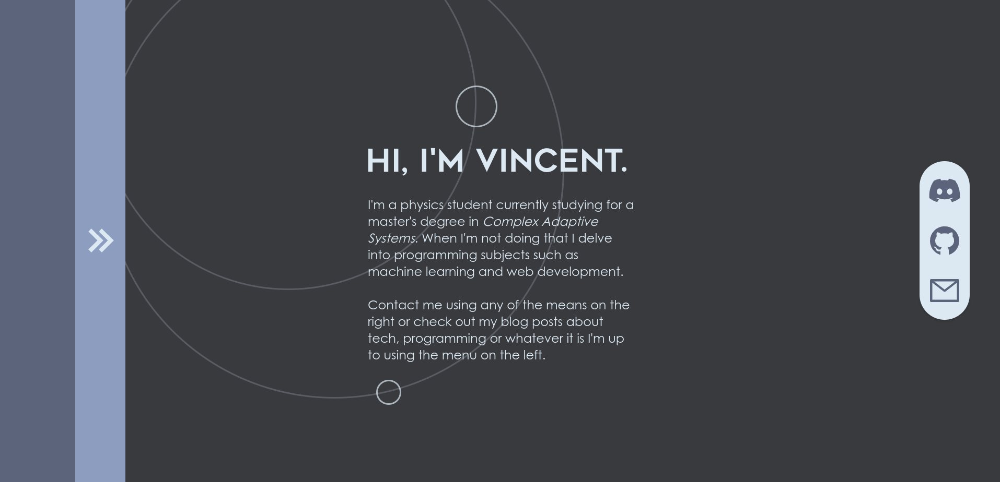

# vincentuden.xyz

This is the source code for my personal website. It was originally written using Astro 1.6 but and React for some components but I've since moved to Astro 3 with Solidjs for the components.



## Building and Running

As usual the website is built using `npm run build` and for development server with _HMR_ use `npm run dev`. I use hte vercel adapter for some small analytics on each route. The analytics is my own home-built solution found at [analytics.vincentuden.xyz](https://analytics.vincentuden.xyz) and the source for that project is also on [GitHub](https://github.com/vincent-uden/analytics).

### Environment Variables
Create a `.env` file in the project root containing:
```
ANALYTICS_URL            = https://analytics.vincentuden.xyz/api/routeaccesslog/log
ANALYTICS_PROJECT_ID     = your_project_id
ANALYTICS_PROJECT_SECRET = your_project_secret
```

## Deployment
Since I use the vercel adapter the project is naturally deployed on [Vercel](https://vercel.com).
