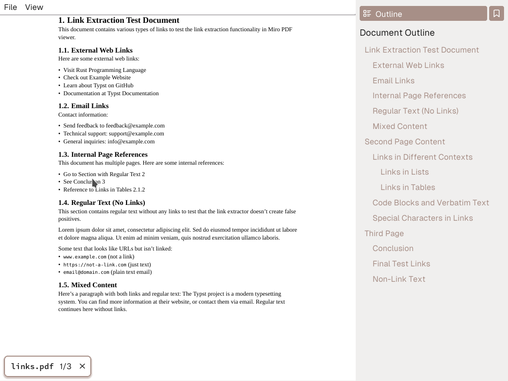

## Why?

Acrobat is intrusive, slow and non-customizable.

Of course there are alternatives, specifically bad ones.

- FoxIt is slow and non-customizable.
- Chrome/Firefox kinda works as a PDF reader, but is lacking in the feature department.

On linux there is (at least) one non-bad PDF reader. Zathura is amazing with the MuPDF backend. However it only works on X11/Xorg and thus Linux. I use Wayland and Windows.

## Zathura-2?

If I could just reach parity with the features from Zathura it would be the perfect program for me. And perhaps I could even create a more approachable program for others as well. 

Zathura is keyboard focused, featuring a modal navigation system and command line, just like in Vim. I love that, but it's not for everyone, and it's not even always for me depending on what I'm doing. Mouse controls are great, when they are optional.

Hot reloading PDFs when they change on disk is a killer feature as well. But it can be pushed even further. What if you switch to another file in your editor? Wouldn't it be nice if the PDF reader could switch with the editor, automatically?

A config for customizing key bindings is a no-brainer. It also comes with a dark-mode, not just for the interface but also for the PDF itself.

Last but not least, it would be nice if the PDF reader could show PDFs.

If I could manage to implement this rather small set of features, where the last feature is the most difficult by far. Then I could go on reading PDFs as a happier man than before.

## PDF rasterisation

I read somewhere once that problems should always be tackled in the order from most to least difficult if you're serious about solving them. Makes enough sense to me. Climb the mountain first and coast downhill afterwards, ticking off features with increasing speed and decreasing effort as you grow tired of the project.

Parsing the gigantic PDF specification and transforming decades worth of revisions into a bunch of pixels is certainly that most difficult task.

Fortunately, this herculean task has already been tackled by others. Once again I took inspiration from Zathura. It has a backend for rendering which uses [MuPDF](https://mupdf.com/) for rasterisation and other PDF-parsing uses. Since I already enjoyed the performance and look of PDFs in Zathura, I might as well base my solution on the same set of giant shoulders.

The [official documentation](https://mupdf.readthedocs.io/en/latest/reference/c/index.html) is pretty good, if you already understand how MuPDF works and just needs to refresh your memory on the API. But when you are just starting to dip your toes into this massive library, some additional structure is greatly appreciated. For this purpose, I read parts of [MuPDF Explored](https://casper.mupdf.com/docs/mupdf_explored.pdf), an online-book by [Robin Watts](https://pdfa.org/people/robin-watts/).

If rasterising PDFs is a passion of yours, I highly recommend the book. It contains everything from the simplest of PDF-to-PNG examples, to cached workflows that achieve hundreds of renders per second.

## User interface

Writing a cross-platform native GUI has always seemed way harder than it has any right to be. On one hand you have the giants, Qt and GTK which expose enormous API surfaces and might require several books of their own to understand properly. Not to mention *interesting* licensing in the case of Qt.

One the other hand you have the Raylib/OpenGL/etc. style of creating user interfaces. Nothing is included, if it is, it isn't customizable at all.

Usually, I am quite partial to the second approach. This time however, I wanted to find something in between the extremes. After rummaging through everything from *Slint* to *Dear Imgui* I finally settled on giving [iced](https://iced.rs/) a shot. As mentioned in [Open source bom management](/blog/pcb_management), I have actually used iced before for smaller programs. Now it was time for something more complex.

Design-wise, there isn't a whole lot to mention. I settled on a pretty standard layout of a main window with a sidebar containing bookmarks and a document outline.



The interface can of course turn dark. And so can the PDF!

**TODO: Image of dark mode PDF**

## Performance

In the grand scheme of things, I'm very happy with the performance of the reader. Specifically I like that it is fast enough to be *simple*. As mentioned by the likes of [Ryan Fleury](https://www.youtube.com/watch?v=_9_bK_WjuYY) and [Vjekoslav Krajačić](https://www.youtube.com/watch?v=bUOOaXf9qIM) among many other: *speed is a feature in itself*.

Zathura with the muPDF backend is unable to zoom smoothly while maintaining a clear rasterisation of the PDF. It zooms optimistically by upscaling the current bitmap which results in a pop-in a fraction of a second later when a crisp rendition replaces the blurred one.

[Miro](https://github.com/vincent-uden/miro) on the other hand leverages a feature called `DisplayList` to cache some data internally in muPDF to achieve several hundred, crisp renders per second if needed.

Before discovering `DisplayList`s, I had a complex and multi threaded system that rendered the PDF in tiles. This was awful to work with. Bugs arose from the asynchronous nature of rendering on a background thread and pixel-perfect rendering was near impossible to get right at tile borders.

Optimizing and probing mupdf for more advanced features led me to a simple solution, over a thousand lines of code shorter than the multi-threaded solution.

The only point where my PDF reader struggles is on pages using embedded svgs (or other PDFs) with several thousand entities contained, such as un-optimized graphs in scientific papers. I would love to resolve this some day.

## Configuration

To me, basic configuration is a must-have for any program I use. As long as I can change the keybindings of common features I'm happy.

Since a PDF **reader** doesn't imply any editing I could avoid implementing a modal keybinding system. Miro uses a simple config file:
```
# Vim-like movement keys
Bind j      MoveDown
Bind k      MoveUp
Bind h      MoveLeft
Bind l      MoveRight
Bind J      NextPage
Bind K      PreviousPage
Bind H      PreviousTab
Bind L      NextTab

# ...

# RPC server settings
Set Rpc False
Set RpcPort 7890

# Display scaling factor for high-DPI displays
# Use 1.0 for normal displays, 1.5 for 150% scaling, 2.0 for 200% scaling, etc.
Set ScaleFactor 1.0
```
In fact the default bindings are bound via a `default.conf`, not hard-coded in the source code.

## Remote procedure calls

Like Zathura, Miro automatically watches all open PDF files to reload them as soon as they change on disk. However we can take that one step further.

If enabled in the config file, Miro can run a server in the background which listens for remote calls from other programs. The RPC server can open PDFs, close them and toggle the dark mode. In the future it could also allow for switching pages.

This implies a possible coupling between your preferred editor (for example Neovim) and the PDF reader. Perhaps you'd want to sync the light/dark color scheme between your editor or desktop environment and Miro. Or you could auto-open PDF files as soon as they are opened in the editor. 

Instead of trying to implement a Latex, Typst or Markdown editor, this approach allows for the integrated editing and preview environment you're used to from web development but for any sort of file that is possible to compile to PDF.

## Where do I get it?

Do you want to compile from source?

```sh
cargo install miro-pdf
```

Are you fine with a pre-compiled binary, are on Windows (compiling this sucks on Windows) or prefer a faster install?

```sh
cargo binstall miro-pdf
```

Do you want a pre-compiled binary but don't have cargo installed? Check out the [release page](https://github.com/vincent-uden/miro/releases).

Want to check out the source code or report an issue? Check out the project on [Github](https://github.com/vincent-uden/miro).

## Concluding thoughts

I am not done with this project, eventually I want to entirely replace the UI layer with a home-cooked GUI library I am working on. Additionally I'd love some light editing features, such as comments or annotations.

Still, I am very satisfied with the outcome. This is my current, best attempt at bringing the Unix philosophy to the process of writing documents that compile to PDFs. Finally I have the reader that fills my needs.
